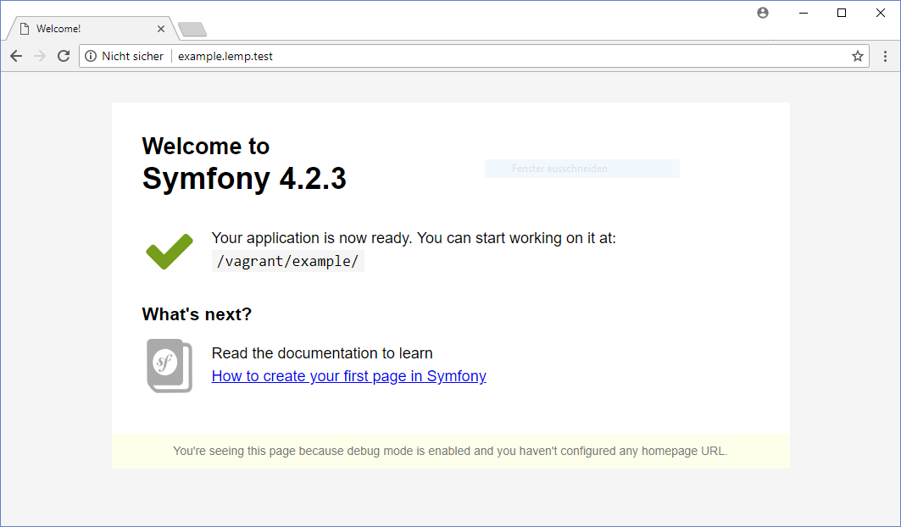

# Vagrant-Debian-Ansible-LEMP

[](https://travis-ci.org/neikei/vagrant-debian-ansible-lemp) [](https://github.com/nikku/works-on-my-machine)

This is a development environment for Symfony projects on a Debian based Vagrantbox.

## Included components

| Software | Debian Jessie | Debian Stretch | Tested   |
|----------|---------------|----------------|----------|
| Debian   | 8.10          | 9.4            | &#10003; |
| Nginx    | 1.14.0        | 1.14.0         | &#10003; |
| MySQL    | 5.5.60        | -              | &#10003; |
| MariaDB  | -             | 10.1.26        | &#10003; |
| Redis    | 2.8.17        | 3.2.6          | &#10003; |
| PHP      | 7.2           | 7.2            | &#10003; |
| PHPUnit  | 7.2.2         | 7.2.2          | &#10003; |
| Composer | 1.6.5         | 1.6.5          | &#10003; |
| Node.js  | 8.11.2        | 8.11.2         | &#10003; |
| Symfony  | 3.4 or 4.1    | 3.4 or 4.1     | &#10003; |

## Requirements

- Hypervisor
  - Virtualbox on Windows and Linux >= 5.2.4
  - Parallels on Mac OS >= 10
- Vagrant >= 2.0.1
- Vagrant Plugins:
  - vagrant-hostmanager # necessary for host entries
  - vagrant-vbguest # recommended for virtualbox users
  - vagrant-winnfsd # only for Windows

## Getting started

1. git clone https://github.com/neikei/vagrant-debian-ansible-lemp.git
2. cd vagrant-debian-ansible-lemp
3. vagrant up --provider=virtualbox OR vagrant up --provider=parallels
4. ... wait ...
5. Check the initial webpage: http://lemp.test/

## Default access

- Default project: http://lemp.test/
- Default web root: /vagrant/web
- Symfony projects: http://example.lemp.test
- Symfony web root: /vagrant/example
- Database: 192.168.56.111:3306
  - user: admin
  - password: changeme
  - root is allowed to access the database from localhost without a password
- Redis: 127.0.0.1:6379

## Symfony3 Debugging

The app_dev.php file of your application has to allow the first IP of the configured network. In the config.yaml example you have to allow the IP '192.168.56.1' in your app_dev.php to use http://example.lemp.test/app_dev.php for debugging.

```php
if (isset($_SERVER['HTTP_CLIENT_IP'])
    || isset($_SERVER['HTTP_X_FORWARDED_FOR'])
    || !(in_array(@$_SERVER['REMOTE_ADDR'], ['127.0.0.1', '::1', '192.168.56.1'], true) || PHP_SAPI === 'cli-server')
) {
    header('HTTP/1.0 403 Forbidden');
    exit('You are not allowed to access this file. Check '.basename(__FILE__).' for more information.');
}
```

## xDebug

xDebug is available on port 9000 from your local machine to debug your application with tools like PHPStorm.

## Configuration

Check the config.yml if you want to modify the following settings.

```yaml
configs:
    os: "9.4"                       # Choose between 8.10 and 9.4 (change requires: vagrant destroy & vagrant up)
    private_ip: "192.168.56.111"    # VM IP in your host-only-network
    vmname: "symfony-development"   # VM name for Virtualbox
    servername: "lemp.test"         # Servername and domain for your projects
    projectnames:                   # Comma-separated list with your symfony projectnames (change requires: vagrant provision & vagrant hostmanager)
      - foo                         # Generated URLs => foo.lemp.test
      - bar                         # Generated URLs => bar.lemp.test
    symfony_version: 4.1            # Symfony version like 4.1 or 3.4
```

Every servername or projectname change needs an update of your local hostfile.

```bash
vagrant hostmanager
```

## Screenshot



## Changelog

The changelog is available [here](docs/changelog.md).

## Feedback, Issues and Pull-Requests

Feel free to report issues, fork this project and submit pull requests.